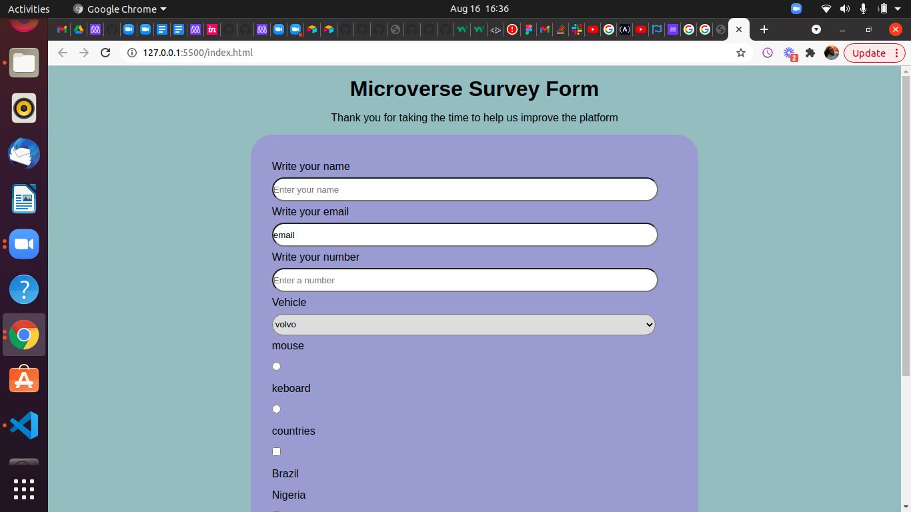

# Surveyform

>
This project displays survey forms on a browser page. This was built with Html, Css,Vscode,Git and Github. 

## Built With

- Html
- Css

## Live Demo

[Live Demo Link]()

## Getting Started

**This is an example of how you may give instructions on setting up your project locally.**
**Modify this file to match your project, remove sections that don't apply. For example: delete the testing section if the currect project doesn't require testing.**

To get a local copy up and running follow these simple example steps.

### Prerequisites
    - VS Code
    -Github

### Setup
   - git clone your repo
   - cd into the folder
   - open index.html with live server

### Install
    VS Code

### Usage
    This is a simple project to dipslay survey forms page.

## Authors

👤 **Author1**
Chukwuebuka Victor Ozoede

👤 **Author2**
Luiz

- GitHub: [@chukwuebukaVictor](https://github.com/chukwuebukaVictor)
- Twitter: [@OzoedeVictor](https://twitter.com/OzoedeVictor)
- LinkedIn: [LinkedIn](www.linkedin.com/in/chukwuebuka-ozoede-46616a219)

## 🤝 Contributing

Contributions, issues, and feature requests are welcome!

Feel free to check the [issues page](https://github.com/chukwuebukaVictor/Microverse_trial_surveyform/issues).

## Show your support

Give a ⭐️ if you like this project!